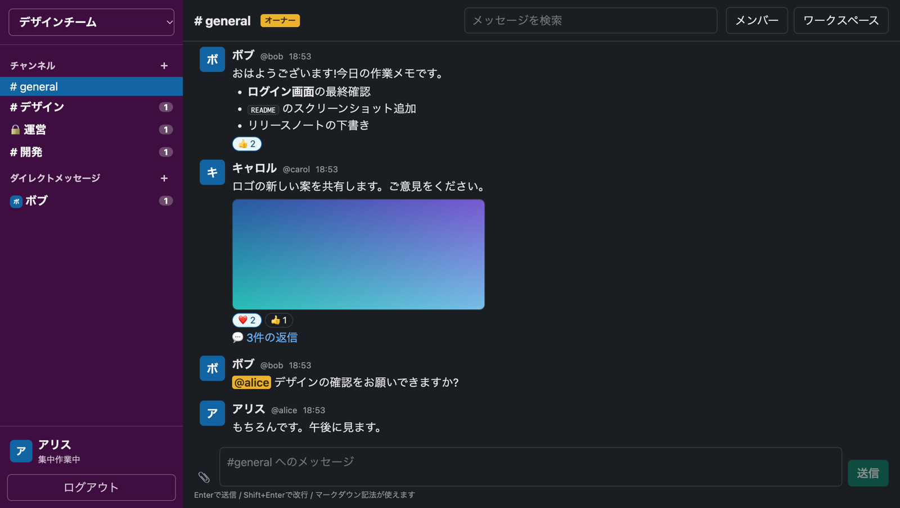
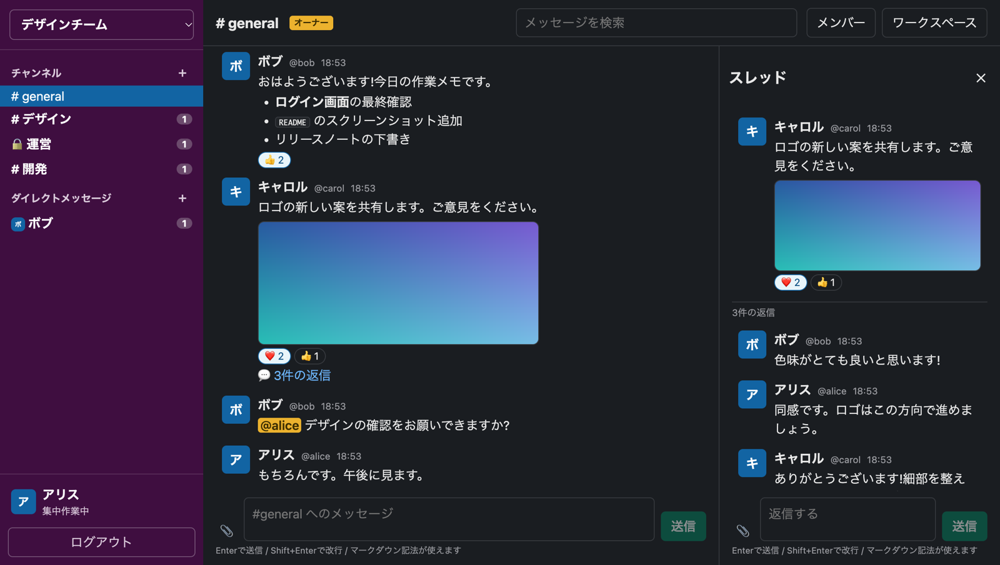
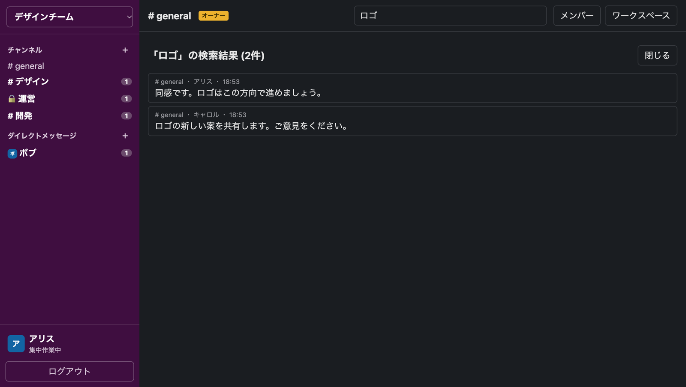
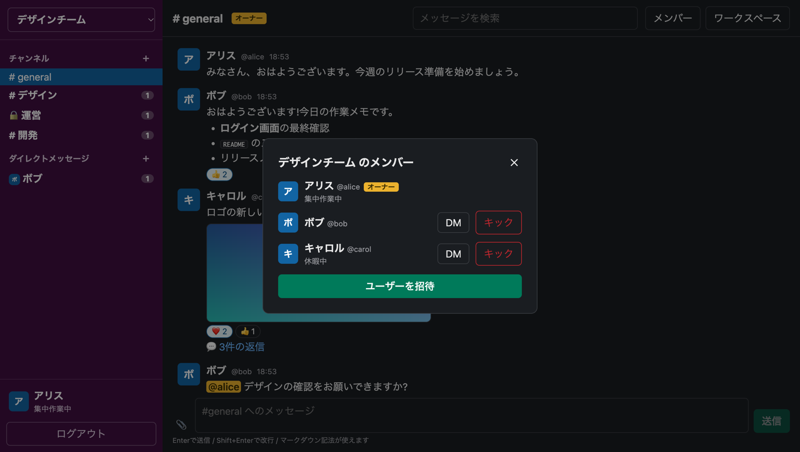
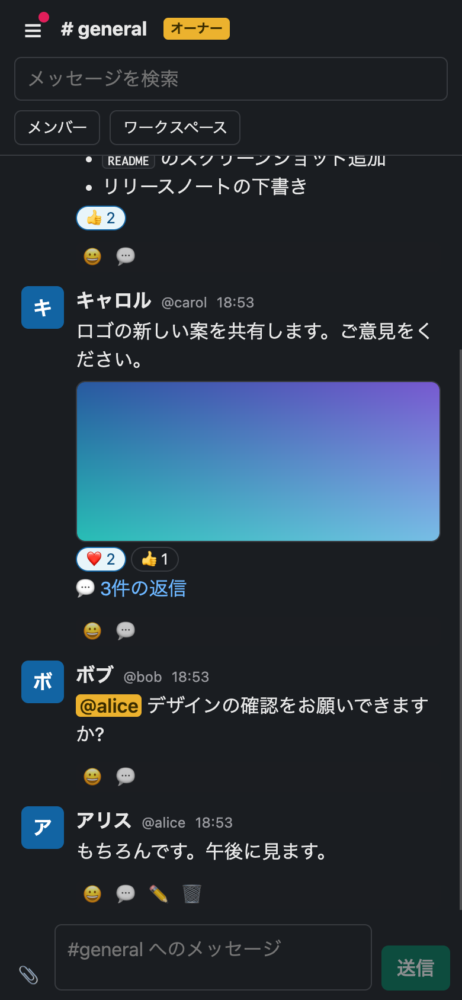
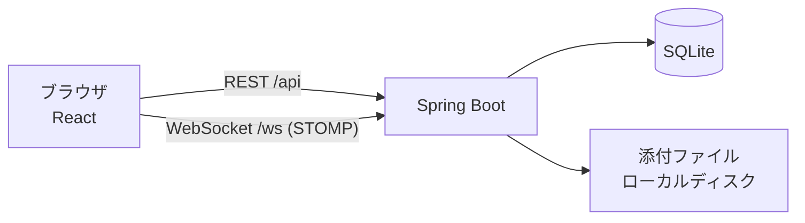

# RaiseChat


Slack風のチャットアプリケーションです。ワークスペース、チャンネル、DM、スレッド、リアクション、メンション、検索、ファイル添付を備え、WebSocket でリアルタイムに更新されます。

- **フルスタック**: Spring Boot(Java 21)と React(TypeScript)
- **インフラまでコード化**: Terraform で AWS(EC2 1台)に、自動HTTPSで公開できます
- **品質**: バックエンド・フロントエンドの自動テストと、GitHub Actions による CI

> **デモサーバーについて:** 費用の都合で、AWS 上のデモサーバーは**停止(削除)しています**。画面は、下のスクリーンショットでご覧ください。手順書どおりに、AWS 上へ再現することも、手元で動かすこともできます([動かし方](#動かし方ローカル) / [AWSへのデプロイ](#awsへのデプロイ))。

## スクリーンショット

(架空のデモデータです)

**チャット**: チャンネル、未読バッジ、DM、メンション、リアクション、画像の添付、マークダウン



**スレッド**: メッセージへの返信を、右側の欄にまとめて表示



**メッセージ検索**



**メンバー管理(オーナー)**: 招待、キック、DM



**スマートフォン幅**: 画面幅に合わせて、レイアウトが切り替わります



## 機能

- **認証・ユーザー**: 新規登録(ユーザーID+パスワードのみ) / ログイン / ログアウト / プロフィール(アバター画像・表示名・ステータス)
- **メッセージング**: チャンネルチャット / DM / 編集・削除 / スレッド返信 / マークダウン / 画像・動画の添付 / 絵文字リアクション / `@ユーザーID` メンション(入力補完つき) / メッセージ検索
- **ワークスペース・チャンネル**: ワークスペースの作成 / パブリック・プライベートチャンネルの作成 / 参加・招待
- **オーナー権限**: ユーザーの招待 / キック / チャンネルの削除(`#general` とDMは削除不可)
- **通知**: 未読バッジ / メンションバッジ / メンション到着のトースト / タブタイトルの未読件数

仕様のメモ:

- ユーザーIDは、半角英数字とアンダースコアの3〜20文字です。
- パブリックチャンネルは、ワークスペースの誰でも「参加」して読み書きできます。プライベートは、チャンネルのメンバーからの招待が必要です。
- ワークスペースに招待されたユーザーは、自動で `#general` に参加します。
- 対象外: ボイスチャンネル。

## 技術スタックと構成

| 層 | 内容 |
|---|---|
| バックエンド | Java 21 / Spring Boot 3.5 / JdbcTemplate / Flyway / SQLite / JWT(jjwt) |
| フロントエンド | React 19 + TypeScript / Vite / react-markdown(+GFM) |
| リアルタイム | WebSocket(STOMP) |
| ファイル保存 | ローカルディスク(`backend/uploads/`) |
| インフラ | Terraform / AWS(EC2、EBS、S3、Route 53)/ Caddy(自動HTTPS) |
| テスト・CI | JUnit(Spring Boot Test)/ Vitest + Testing Library / GitHub Actions |



設計のポイント:

- **更新の合図だけを WebSocket で送る**: メッセージの本体は流さず、「チャンネル X に更新あり」という合図(IDと種別)だけを配信します。受け取った画面が、REST で最新のデータを取り直します。権限の判定を REST に集約でき、通知の実装も単純になります(切断時は自動で再接続し、取りこぼしも再取得で補います)。
- **DB の変更は Flyway で管理**: スキーマは、バージョン付きのSQLで、起動時に自動で適用されます。
- **WebSocket の購読にも認可をかける**: 接続時に JWT を検証し、チャンネルの通知は、そのチャンネルのメンバーだけが購読できます。クライアントからの送信は、すべて拒否します(メッセージの送信は REST のみ)。
- **1台構成を前提にした設計**: データ(DB・添付ファイル・通知)がサーバー内にあるため、スケールアップで負荷に対応します。台数を増やす(スケールアウト)には、DB・添付ファイル・通知の共有化が必要です([AWSデプロイ手順](docs/AWSデプロイ手順.md)の9章)。

## 動かし方(ローカル)

ポートは固定です(バックエンド **8080** / フロントエンド **5173**)。競合したときは、別のポートに逃がさず、使用中のプロセスを停止してください。前提ツール、ポート競合時の対処、データの初期化、トラブルシューティングは、[ローカル開発環境セットアップ](docs/ローカル開発環境セットアップ.md)を参照してください。

```bash
# バックエンド(Java 21 と Maven が必要)
cd backend && mvn spring-boot:run

# フロントエンド(別のターミナル。Node.js が必要)
cd frontend && npm install && npm run dev
```

http://localhost:5173 を開き、新規登録から始めます。DB(`backend/raisechat.db`)と添付ファイル(`backend/uploads/`)は、初回の起動で作られます(いずれもgit管理外)。

## テストとCI

```bash
cd backend && mvn test                                        # バックエンド
cd frontend && npm run lint && npm test && npm run build      # フロントエンド
```

GitHub Actions(`.github/workflows/ci.yml`)が、PRと `main` への push のたびに、同じ確認を自動で実行します。リントは `--deny-warnings` のため、**警告があっても失敗します**(やむを得ず抑制する場合は、`oxlint-disable-next-line` に理由のコメントを添えます)。

## セキュリティ

- **パスワード**: BCrypt でハッシュ化します。8〜64文字で、**72バイト以内**(BCryptの上限。日本語は1文字が3バイトです)。
- **ログイン**: 存在しないユーザーIDでも、パスワードの照合を行い、応答時間の差からIDの有無が分からないようにしています。
- **JWT の秘密鍵**: 環境変数 `JWT_SECRET` で指定します。未設定のときは開発用の既定値で動きますが(公開されている値です)、`SPRING_PROFILES_ACTIVE=prod` では、既定値のまま、または32バイト未満の鍵だと、**起動に失敗**します。
- **アップロード**: ファイルの種類は、申告された Content-Type や拡張子ではなく、**ファイルの先頭バイト**で判定します(png / jpg / gif / webp / mp4 / webm のみ。SVG や HTML は拒否)。配信には、`X-Content-Type-Options: nosniff` と `Content-Security-Policy: default-src 'none'; sandbox` を付けます。添付のURLは、`/uploads/{ファイル名}` の形だけを受け付けます。
- **HTTP ヘッダー**: `X-Content-Type-Options` / `X-Frame-Options` / `Referrer-Policy` を、すべての応答に付けます(画面の配信では、CSP も付けます)。
- **リクエストの制限**: JSON 本文は1MBまで(`app.max-json-body-bytes`)、ファイルのアップロードは50MBまでです。
- **WebSocket の接続元**: 既定では、画面と同じオリジンだけを許可します。別のオリジンから使うときは、`app.websocket.allowed-origins`(カンマ区切り、例 `https://chat.example.com`)に指定します。

## AWSへのデプロイ

Terraform で、AWS の EC2 1台に構築できます。インフラは `terraform/` のコードで作り、アプリの更新は `deploy/deploy.sh` で行います。

| 内容 | 詳細 |
|---|---|
| 構成 | EC2(Amazon Linux 2023)+ Elastic IP + データ用EBS(暗号化・日次スナップショット)+ 成果物用の非公開S3 |
| HTTPS | Caddy が、Let's Encrypt の証明書を自動で取得・更新します(ドメイン未設定の間は、`<IP>.sslip.io` で動作) |
| 操作 | SSH は開けず、SSM Session Manager を使います。IAM は最小限です |
| 補助スクリプト | `deploy/deploy.sh`(ビルド → 更新) / `deploy/set-domain.sh`(独自ドメインへの切り替え) / `deploy/power.sh`(停止・再開・状態確認) |

手順(構築、デプロイ、ドメイン、運用、バックアップ、費用、削除)は、[docs/AWSデプロイ手順.md](docs/AWSデプロイ手順.md)にあります。

## ディレクトリ構成

```
backend/     Spring Boot(API・WebSocket・DBのマイグレーション・テスト)
frontend/    React + TypeScript(画面・テスト)
terraform/   AWS のインフラ(EC2・EBS・S3・IAM など)
deploy/      デプロイ・ドメイン切り替え・停止/再開のスクリプト
docs/        手順書とスクリーンショット
```

## 開発の進め方

GitHub の Issue → ブランチ → Pull Request の流れで開発しています(`main` への直接の push はしません)。詳しくは、[CLAUDE.md](CLAUDE.md)を参照してください。

## ライセンス

[MIT License](LICENSE)
